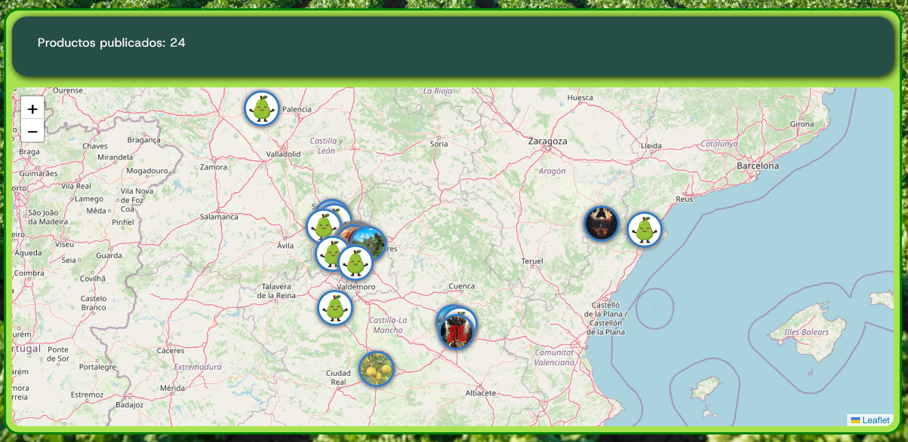

#
https://despensa-comun.vercel.app

 https://despensacomun.onrender.com 

[README Backend](backend/readme.md)

[README Frontend](despensafront/README.md)

#

# LA DESPENSA COMÚN

## 1. Presentación

DespensaComun es una red de trueque y donación entre personas que cultivan en casa pequeñas cantidades de frutas y hortalizas u otros recursos. 

Como práctica, abarca el desarrollo backend con MongoDB, Mongoose, Express y controladores RESTful enlazado a un frontend hecho con React.

El objetivo de este proyecto es realizar una prueba completa de aplicación web funcional para posteriormente probarla en un entorno real y localizado en prueblos de la Sierra de Guadarrama.

## 2. Liberías utilizadas

### Leaflet + React-Leaflet

Es el motor de los mapas que se muestran en las páginas de bienvenida y detalle de usuario. Renderiza un mapa interactivo que coloca marcadores en la ubicación de productos o usuarios con popups que muestran información de los mismos según el caso y el contexto de autenticación.

### OpenStreetMap / Nominatim

Aunque no se trata de una librería, es el servicio utilizado para rellenar las búsquedas de Ciudades o Pueblos. Para evitar que el usuario introduzca un string con un nombre en el input, se sugieren coincidencias sobre las que hay que hacer click. Esto asegura que se proporciona un nombre de localización y unas coordenadas.

##

**Carlos CM**

[LinkedIn](https://www.linkedin.com/in/carloscampillovfx/)

Entrega de Proyecto Final. {RTC - Desarrollo Web}.

*Enero de 2026*