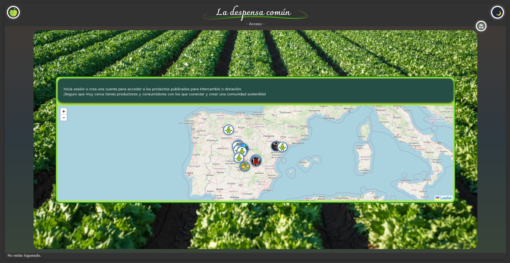
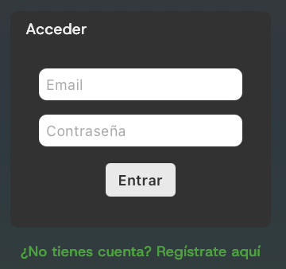
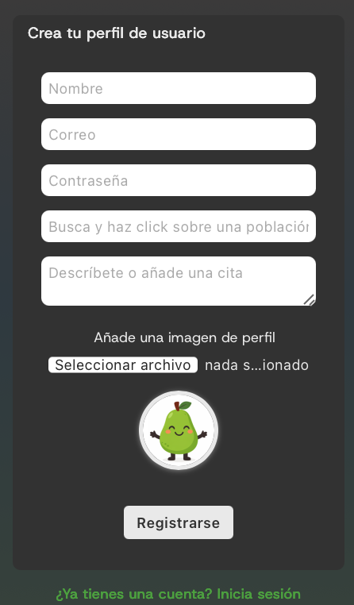
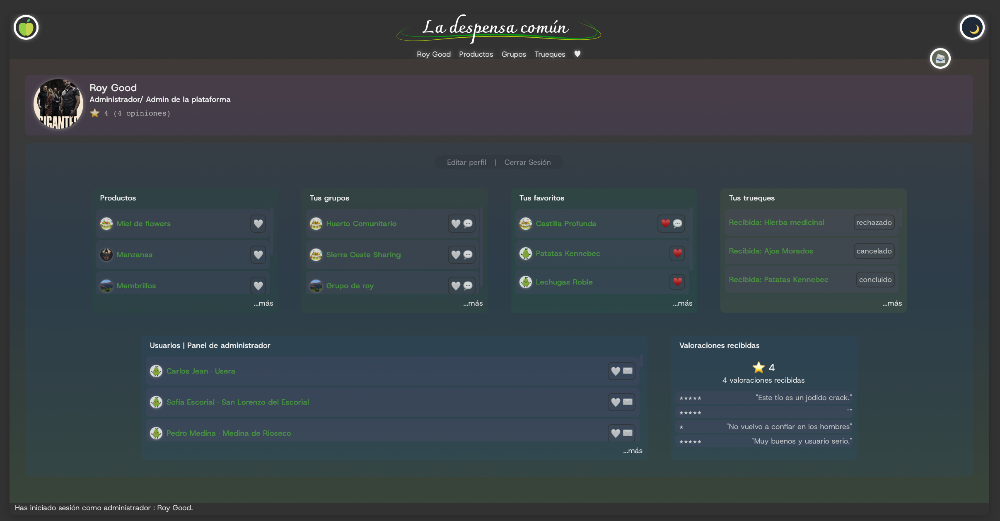
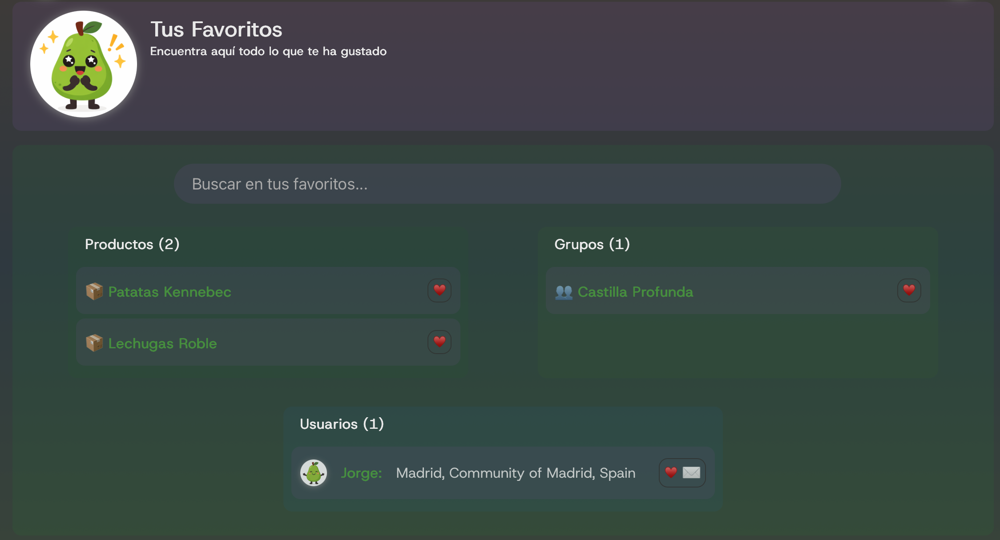
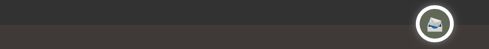
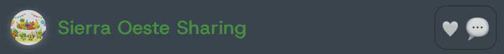
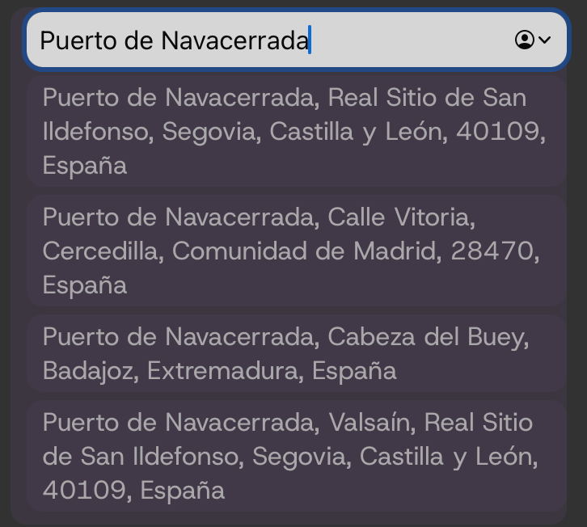

#
https://despensa-comun.vercel.app

 https://despensacomun.onrender.com 

[README Backend](backend/readme.md)

[README Frontend](despensafront/README.md)

#

# LA DESPENSA COMÚN

## 1. Presentación

DespensaComun es una red de trueque y donación entre personas que cultivan en casa pequeñas cantidades de frutas y hortalizas u otros recursos. 

Como práctica, abarca el desarrollo backend con MongoDB, Mongoose, Express y controladores RESTful enlazado a un frontend hecho con React.

El objetivo de este proyecto es realizar una prueba completa de aplicación web funcional para posteriormente probarla en un entorno real y localizado en prueblos de la Sierra de Guadarrama.

### 1.1 Funcionamiento

La página **Welcome** de la aplicación nos muestra un mapa en el que se muestran una serie de productos disponibles. 

Para poder acceder tanto a su información como a las funciones de interacción con la comunidad será necesario iniciar sesión desde *Acceso* en la parte superior de esta misma página.

Una vez iniciada la sesión, ya podemos acceder a la información de los productos del mapa y a las diferentes secciones, bien desde los accesos directos de la navegación superior o desde los propios Cards que nos resumen cada una de las categorías:

* ### Editar perfil/ cerrar sesión.
* ### Productos.
  * Listado de productos subidos por el usuario logueado.
    * Detalle de cada producto pinchando sobre su enlace. Podremos editar o eliminar nuestros productos.
    * Publicar un producto.
  * Listado de productos disponibles subidos por otros usuarios, desde donde podemos proponer intercambios o hacer solicitudes al productor.

* ### Grupos.
  * Listado de grupos creados por el usuario logueado.
  * Crear un nuevo grupo.
  * Listado de grupos abiertos de otros usuarios a los que podemos solicitar unirnos.

* ### Favoritos.
 Muestran tarjetas con los productos, grupos o usuarios que hayamos marcado como favoritos para localizarlos más cómodamente. Para guardar o descartar un favorito sólo hay que pulsar sobre el corazón cuando este se encuentre disponible.

* ### Trueques.
  * Solicitudes para ti. Son las solicitudes de intercambio o donación de otros usuarios que desean tus productos. Puedes aceptarlas o rechazarlas.
  * Peticiones enviadas. Son aquellas que tú has enviado a otros usuarios. Verás en cada línea su estado actual seguido de las opciones disponibles para Anular, confirmar la entrega y valorar la experiencia dejando una reseña al usuario. 
* ### Valoraciones de otros usuarios.
  * Sólo pueden hacerse al finalizar una transacción. Es el momento de valorar la transacción y al usuario, tanto si ha finalizado correctamente o ha sido cancelada.

* Chat. Accesible mediante el botón de chat desde cualquier punto de la aplicación (para buscar todas las conversaciones) o desde la línea correspondiente a usuarios o grupos (accediendo directamente a la conversación privada o chat de grupo que corresponda). 

## 2. Liberías utilizadas

### Leaflet + React-Leaflet

Es el motor de los mapas que se muestran en las páginas de bienvenida y detalle de usuario. Renderiza un mapa interactivo que coloca marcadores en la ubicación de productos o usuarios con popups que muestran información de los mismos según el caso y el contexto de autenticación.

### OpenStreetMap / Nominatim

Aunque no se trata de una librería, es el servicio utilizado para rellenar las búsquedas de Ciudades o Pueblos. Para evitar que el usuario introduzca un string con un nombre en el input, se sugieren coincidencias sobre las que hay que hacer click. Esto asegura que se proporciona un nombre de localización válido y unas coordenadas.

##

**Carlos CM**

[LinkedIn](https://www.linkedin.com/in/carloscampillovfx/)

Entrega de Proyecto Final. {RTC - Desarrollo Web}.

*Enero de 2026*